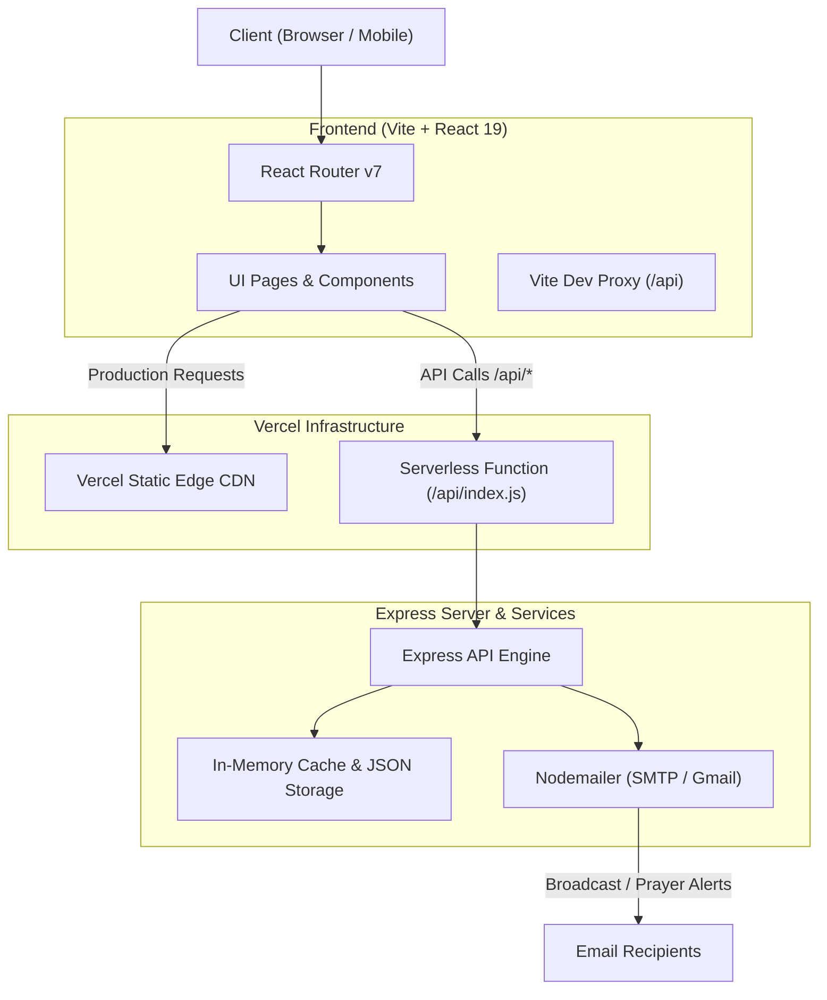

# ✝️ Zionix — Fullstack Scripture & Devotional Platform

<p align="center">
  
</p>

<p align="center">
  <strong>An elegant, modern sanctuary for daily scripture study, communal prayer, and gospel exploration.</strong>
</p>

<p align="center">
  
  
  
  
  
</p>

---

## 📖 Table of Contents

- [Overview](#-overview)
- [Key Features](#-key-features)
- [Tech Stack](#-tech-stack)
- [System Architecture](#-system-architecture)
- [Project Structure](#-project-structure)
- [Quick Start](#-quick-start)
- [Environment Variables](#-environment-variables)
- [API Reference](#-api-reference)
- [Deploying to Vercel](#-deploying-to-vercel)
- [License & Dedication](#-license--dedication)

---

## 🌟 Overview

**Zionix** is a full-stack Christian spiritual portal engineered with a serene UI and responsive performance. It bridges timeless biblical truths with modern web technologies, providing believers and seekers with tools to nourish their spiritual lives every day.

Whether reading through books of the Bible, sharing burdens on the community prayer wall, receiving morning devotional reflections, or exploring the core message of the gospel, Zionix provides an intuitive and uplifting experience.

---

## ✨ Key Features

### 🌅 Daily Bread & Morning Reflection
- **Scripture of the Day:** Fresh daily verses rendered with rich theological context.
- **Morning Reflection:** Curated devotionals that bring scripture alive for contemporary living.
- **"Living It Out":** 3 actionable, practical bullet points designed to apply truth throughout the day.
- **Audio & Share:** Read aloud text-to-speech support and one-click WhatsApp sharing.
- **Recent Reflections Archive:** Instant access to devotions from past days.

### 📜 Comprehensive Bible Explorer
- **66-Book Bible:** Full Old and New Testament reader across chapters and verses.
- **Lightning-Fast Search:** High-speed full-text keyword indexing across the entire Bible dataset.
- **Scripture Navigation:** Seamless book selection, chapter flipping, and responsive text sizing.

### 🙏 Interactive Prayer Wall
- **Intercession Requests:** Community members submit prayers with custom categories.
- **Confidentiality Toggles:** Option to mark prayers public for community agreement or private for the core pastoral team.
- **Automated Email Dispatch:** Real-time email notifications dispatched via Nodemailer to the prayer team whenever a new prayer burden is submitted.

### 🕊️ Gospel Clarity & Foundations
- **Doctrinal Walkthroughs:** Clear, scripture-anchored explorations of salvation, faith, and grace.
- **Searchable Theological Topics:** Guides designed to address foundational questions about Christian theology.

### 🛡️ Developer & Admin Devotional Studio
- **Admin Control Center:** Secure portal for developers and content curators.
- **Real-Time Daily Bread Editor:** Publish new verses and devotions on the fly.
- **Community Broadcast Engine:** Automatically sends customized HTML email notifications to all registered believers when a new Daily Bread is published.
- **Prayer Wall Moderation:** Review and manage prayer petitions submitted by the community.

### 🔐 Google OAuth & User Profiles
- Single-click Google login support with customizable avatar and persistent user session.

---

## 🛠️ Tech Stack

### Frontend
| Technology | Description |
| :--- | :--- |
| **React 19** | Modern declarative UI component library |
| **Vite 8** | High-performance build tool and local dev server |
| **Tailwind CSS** | Utility-first responsive design and aesthetic styling |
| **React Router v7** | Client-side routing and navigational history |
| **Lucide React** | Consistent, modern iconography |
| **Framer Motion** | Fluid animations and subtle transition physics |

### Backend & API
| Technology | Description |
| :--- | :--- |
| **Node.js (ESM)** | Modern ECMAScript module runtime |
| **Express.js** | RESTful routing and API middleware |
| **Nodemailer** | SMTP mail transport for prayer and broadcast notifications |
| **JSON Database** | Fast in-memory cached flat-file data architecture |
| **Vercel Serverless** | Serverless function deployment via edge infrastructure |

---

## 🏛️ System Architecture



---

## 📂 Project Structure

```text
Zionix/
├── api/
│   └── index.js             # Vercel Serverless Function entry point
├── backend/
│   ├── data/
│   │   ├── bible.json            # Complete 66-book Bible text (6.7 MB)
│   │   ├── dailyVerse.json       # Current active daily bread & devotion
│   │   ├── gospel.json           # Categorized gospel doctrines & topics
│   │   ├── prayerRequests.json   # Submitted prayer requests
│   │   ├── recentReflections.json# Historical daily reflections archive
│   │   └── users.json            # Registered user profiles
│   ├── server.js            # Core Express application logic & routes
│   └── package.json         # Backend standalone package config
├── frontend/
│   ├── public/              # Static public assets & favicons
│   ├── src/
│   │   ├── assets/          # Artwork, images & brand icons
│   │   ├── components/      # Reusable UI components (NavBar, Footer, Modal)
│   │   ├── context/         # React Context state providers
│   │   ├── pages/           # Route views (Home, Bible, Prayer, Admin, etc.)
│   │   ├── App.jsx          # Root application routing layout
│   │   └── main.jsx         # React DOM entry point
│   ├── package.json         # Frontend dependencies & scripts
│   └── vite.config.js       # Vite configuration with API proxy
├── package.json             # Root monorepo workspace & concurrently scripts
├── vercel.json              # Vercel deployment, function bundling & route rules
└── README.md                # Project documentation
```

---

## 🚀 Quick Start

### Prerequisites
- [Node.js](https://nodejs.org/) (version 18.0.0 or higher recommended)
- [npm](https://www.npmjs.com/) (version 9.0.0 or higher)
- [Git](https://git-scm.com/)

### 1. Clone the Repository
```bash
git clone https://github.com/<your-username>/zionix.git
cd zionix
```

### 2. Install All Dependencies
Install dependencies across the root, backend, and frontend with a single command:
```bash
npm run install-all
```
*(Or install manually inside each folder: `npm install`, `cd backend && npm install`, `cd ../frontend && npm install`).*

### 3. Run in Development Mode
Launch both the Express backend and the Vite frontend concurrently:
```bash
npm run dev
```

- **Frontend Client:** [http://localhost:5173](http://localhost:5173)
- **Backend API:** [http://localhost:5000](http://localhost:5000)
- **API Health Check:** [http://localhost:5000/api/health](http://localhost:5000/api/health)

---

## 🔑 Environment Variables

To enable email notifications and Google authentication, configure an `.env` file or provide them in your hosting provider's dashboard:

### Backend Configuration (`backend/.env` or root):
```ini
# Server Port (Defaults to 5000 in local dev)
PORT=5000

# Email Recipient for Community Prayer Requests
PRAYER_EMAIL_RECIPIENT=dineshbabu192006@gmail.com

# Gmail SMTP Service (Recommended for notifications & broadcasts)
GMAIL_USER=your-service-email@gmail.com
GMAIL_APP_PASS=your16chargoogleapppass

# Alternative Custom SMTP Configuration
SMTP_HOST=smtp.yourprovider.com
SMTP_PORT=587
SMTP_USER=your-username
SMTP_PASS=your-password
```

### Frontend Configuration (`frontend/.env`):
```ini
# Google OAuth Client ID (optional, for Google Sign-In)
VITE_GOOGLE_CLIENT_ID=your-google-client-id.apps.googleusercontent.com
```

---

## 📡 API Reference

| Method | Endpoint | Description | Auth Required |
| :--- | :--- | :--- | :---: |
| `GET` | `/api/health` | Service health status check | No |
| `GET` | `/api/daily-verse` | Fetch today's Scripture, reflection & recent history | No |
| `GET` | `/api/bible/:book/:chapter` | Get all verses for a given book and chapter | No |
| `GET` | `/api/bible/search?q=:query` | Search Bible text for keywords (limit 50) | No |
| `GET` | `/api/gospel/topics` | Get categorized gospel topics & explanations | No |
| `POST` | `/api/prayer-request` | Submit a prayer request & notify team | No |
| `POST` | `/api/auth/google-login` | Authenticate or sync Google user profile | No |
| `POST` | `/api/admin/login` | Authenticate developer/admin credentials | No |
| `GET` | `/api/admin/daily-verse` | Retrieve current devotion and archive | Admin Token |
| `POST` | `/api/admin/daily-verse` | Update Daily Bread & broadcast email to all users | Admin Token |
| `GET` | `/api/admin/prayer-requests` | View all community prayer requests | Admin Token |
| `GET` | `/api/admin/users` | List registered believers & profiles | Admin Token |

---

## ☁️ Deploying to Vercel

The project includes an optimized [`vercel.json`](file:///d:/Zionix/vercel.json) preconfigured for serverless fullstack deployment:

1. **Push your code to GitHub:**
   ```bash
   git add .
   git commit -m "Deploy Zionix to Vercel"
   git push origin main
   ```
2. **Import into Vercel:**
   - Connect your GitHub repository in the [Vercel Dashboard](https://vercel.com/new).
   - Set **Root Directory** to `./` (do not select `frontend`).
   - The build settings and routes are automatically handled by [`vercel.json`](file:///d:/Zionix/vercel.json).
3. **Set Environment Variables:**
   - In **Project Settings** → **Environment Variables**, add `GMAIL_USER`, `GMAIL_APP_PASS`, and optionally `VITE_GOOGLE_CLIENT_ID`.
4. **Deploy:** Click **Deploy** and your fullstack app will be live with full API functionality.

---

## 🤝 Contributing

Contributions are welcomed! Whether it's enhancing the UI, adding translation support, or improving accessibility:

1. Fork the Project
2. Create your Feature Branch (`git checkout -b feature/FaithFeature`)
3. Commit your Changes (`git commit -m 'Add new devotional feature'`)
4. Push to the Branch (`git push origin feature/FaithFeature`)
5. Open a Pull Request

---

## 📜 License & Dedication

Distributed under the **MIT License**. Created with dedication to serve spiritual growth and community fellowship.

> *"Thy word is a lamp unto my feet, and a light unto my path."* — **Psalm 119:105**
